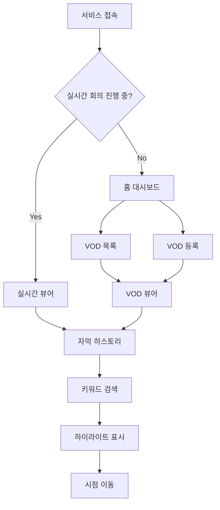

# User Flow (사용자 흐름도)

> 경기도의회 실시간 자막 서비스

---

## 1. 전체 사용자 흐름



---

## 2. 메인 플로우

### 2.1 실시간 시청 플로우

```
[사용자] ─────────────────────────────────────────────────────────────
    │
    ▼
┌──────────────────────────────────────────────────────────────────┐
│  1. 서비스 접속                                                   │
│     └─ URL 접속 (인증 없음)                                       │
└──────────────────────────────────────────────────────────────────┘
    │
    ▼
┌──────────────────────────────────────────────────────────────────┐
│  2. 홈 대시보드 확인                                              │
│     ├─ 현재 실시간 회의 상태 확인                                 │
│     │   └─ [방송중] 표시 → "실시간 시청" 버튼 활성화             │
│     └─ 최근 VOD 목록 확인                                         │
└──────────────────────────────────────────────────────────────────┘
    │
    ▼
┌──────────────────────────────────────────────────────────────────┐
│  3. 실시간 시청 클릭                                              │
│     └─ 실시간 뷰어 화면으로 이동                                  │
└──────────────────────────────────────────────────────────────────┘
    │
    ▼
┌──────────────────────────────────────────────────────────────────┐
│  4. 실시간 뷰어                                                   │
│     ├─ 좌측 70%: 영상 플레이어 (HLS 스트림)                       │
│     ├─ 우측 30%: 자막 히스토리 (실시간 업데이트)                  │
│     │   └─ 새 자막 도착 시 자동 스크롤                            │
│     └─ 상단: 검색창                                               │
└──────────────────────────────────────────────────────────────────┘
    │
    ├─── [검색] ───────────────────────────────────────────────────
    │    │
    │    ▼
    │ ┌──────────────────────────────────────────────────────────┐
    │ │  5a. 키워드 검색                                          │
    │ │      ├─ 검색어 입력                                       │
    │ │      ├─ 자막 히스토리에서 키워드 하이라이트               │
    │ │      └─ 하이라이트된 자막 클릭 → 해당 시점 이동           │
    │ └──────────────────────────────────────────────────────────┘
    │
    └─── [자막 클릭] ─────────────────────────────────────────────
         │
         ▼
      ┌──────────────────────────────────────────────────────────┐
      │  5b. 시점 이동                                            │
      │      └─ 자막 항목 클릭 → 영상 해당 시점으로 이동          │
      └──────────────────────────────────────────────────────────┘
```

### 2.2 VOD 시청 플로우

```
[사용자] ─────────────────────────────────────────────────────────────
    │
    ▼
┌──────────────────────────────────────────────────────────────────┐
│  1. 홈 대시보드 접속                                              │
│     └─ VOD 목록 확인                                              │
└──────────────────────────────────────────────────────────────────┘
    │
    ├─── [기존 VOD 선택] ──────────────────────────────────────────
    │    │
    │    ▼
    │ ┌──────────────────────────────────────────────────────────┐
    │ │  2a. VOD 목록에서 선택                                    │
    │ │      ├─ 회의 날짜, 제목, 재생 시간 확인                   │
    │ │      └─ 클릭하여 VOD 뷰어로 이동                          │
    │ └──────────────────────────────────────────────────────────┘
    │
    └─── [새 VOD 등록] ────────────────────────────────────────────
         │
         ▼
      ┌──────────────────────────────────────────────────────────┐
      │  2b. VOD URL 등록                                         │
      │      ├─ "VOD 등록" 버튼 클릭                              │
      │      ├─ 모달: 회의 제목, VOD URL 입력                     │
      │      ├─ 등록 → 자막 생성 시작 (배경)                      │
      │      └─ "자막 생성 중..." 상태 표시                       │
      └──────────────────────────────────────────────────────────┘
    │
    ▼
┌──────────────────────────────────────────────────────────────────┐
│  3. VOD 뷰어                                                      │
│     ├─ 좌측 70%: 영상 플레이어 (MP4)                              │
│     │   └─ 재생/일시정지, 배속 조절, 타임라인 시크                │
│     ├─ 우측 30%: 자막 히스토리 (전체 로드됨)                      │
│     │   └─ 현재 재생 위치에 따라 자막 하이라이트                  │
│     └─ 상단: 검색창                                               │
└──────────────────────────────────────────────────────────────────┘
    │
    ▼
┌──────────────────────────────────────────────────────────────────┐
│  4. 검색 & 탐색                                                   │
│     ├─ 키워드 검색 → 하이라이트                                   │
│     └─ 자막 클릭 → 해당 시점으로 이동                             │
└──────────────────────────────────────────────────────────────────┘
```

---

## 3. 화면별 상세 흐름

### 3.1 홈 대시보드

```
┌─────────────────────────────────────────────────────────────────┐
│  홈 대시보드                                                     │
├─────────────────────────────────────────────────────────────────┤
│                                                                  │
│  ┌───────────────────────────────────────────────────────────┐  │
│  │  🔴 실시간 회의                                            │  │
│  │  ───────────────────────────────────────────────────────  │  │
│  │  제11대 제396회 임시회 본회의                              │  │
│  │  상태: 방송중 | 시작: 10:00                                │  │
│  │                                                            │  │
│  │  [실시간 시청하기] 버튼                                    │  │
│  └───────────────────────────────────────────────────────────┘  │
│                                                                  │
│  ┌───────────────────────────────────────────────────────────┐  │
│  │  📁 최근 VOD                             [전체보기] [등록] │  │
│  │  ───────────────────────────────────────────────────────  │  │
│  │  • 2026-02-04 | 예산결산특별위원회 | 2:30:15 | ✅ 자막완료 │  │
│  │  • 2026-02-03 | 기획재정위원회    | 1:45:30 | ✅ 자막완료 │  │
│  │  • 2026-02-02 | 본회의            | 3:20:00 | ⏳ 자막생성중│  │
│  └───────────────────────────────────────────────────────────┘  │
│                                                                  │
└─────────────────────────────────────────────────────────────────┘

[User Actions]
1. "실시간 시청하기" 클릭 → 실시간 뷰어
2. VOD 항목 클릭 → VOD 뷰어
3. "전체보기" 클릭 → VOD 목록
4. "등록" 클릭 → VOD 등록 모달
```

### 3.2 실시간 뷰어

```
┌─────────────────────────────────────────────────────────────────┐
│  🔴 실시간 | 제11대 제396회 임시회 본회의          [🔍 검색]    │
├───────────────────────────────────────────┬─────────────────────┤
│                                           │  자막 히스토리       │
│                                           │  ─────────────────  │
│           [영상 플레이어]                 │  10:15:30           │
│                                           │  의장님, 제가...     │
│            HLS 스트리밍                   │  ─────────────────  │
│                                           │  10:15:45           │
│           (70% 너비)                      │  예산안에 대해서...  │
│                                           │  ─────────────────  │
│                                           │  10:16:02           │
│                                           │  추경 예산이...      │  ← 최신
│                                           │  ─────────────────  │
│                                           │        (30% 너비)   │
├───────────────────────────────────────────┴─────────────────────┤
│  ⏯️ 라이브    🔊 볼륨                                            │
└─────────────────────────────────────────────────────────────────┘

[User Actions]
1. 자막 항목 클릭 → 해당 시점으로 영상 이동
2. 검색창 입력 → 키워드 하이라이트
3. 검색 결과(하이라이트된 자막) 클릭 → 시점 이동
```

### 3.3 VOD 뷰어

```
┌─────────────────────────────────────────────────────────────────┐
│  📁 VOD | 2026-02-04 예산결산특별위원회             [🔍 검색]    │
├───────────────────────────────────────────┬─────────────────────┤
│                                           │  자막 히스토리       │
│                                           │  ─────────────────  │
│           [영상 플레이어]                 │  00:05:30           │
│                                           │  위원장님, ...       │
│            MP4 재생                       │  ─────────────────  │
│                                           │▶ 00:05:45  ← 현재   │
│           (70% 너비)                      │  예산 심의를...      │
│                                           │  ─────────────────  │
│                                           │  00:06:02           │
│                                           │  작년 대비...        │
│                                           │  ─────────────────  │
│                                           │        (30% 너비)   │
├───────────────────────────────────────────┴─────────────────────┤
│  ◀◀ ⏯️ ▶▶ | 00:05:45 / 2:30:15 | 🔊 | 1x [1x 1.5x 2x]          │
│  [────────●──────────────────────────────────────────] 타임라인  │
└─────────────────────────────────────────────────────────────────┘

[User Actions]
1. 자막 항목 클릭 → 해당 시점으로 영상 이동
2. 타임라인 드래그 → 시점 이동
3. 배속 조절 → 1x, 1.5x, 2x
4. 검색 → 키워드 하이라이트
```

---

## 4. 예외 흐름

### 4.1 실시간 회의 없음

```
홈 대시보드
    │
    └─ 실시간 회의 영역
        └─ "현재 진행 중인 회의가 없습니다."
           "다음 회의 일정: 2026-02-06 10:00"
```

### 4.2 VOD 자막 생성 중

```
VOD 목록
    │
    └─ VOD 항목
        └─ 상태: "자막 생성 중... (60%)"
           [클릭 시] → 자막 없이 영상만 재생 가능
```

### 4.3 검색 결과 없음

```
검색창에 "XYZ123" 입력
    │
    └─ 자막 히스토리
        └─ "검색 결과가 없습니다."
           [검색어 지우기] 버튼
```

### 4.4 네트워크 오류

```
실시간 뷰어
    │
    └─ WebSocket 연결 끊김
        └─ 토스트: "연결이 끊어졌습니다. 재연결 중..."
           [자동 재연결 시도]
           [수동 재연결] 버튼
```

---

## 5. 화면 전환 매트릭스

| From \ To | 홈 | 실시간 뷰어 | VOD 목록 | VOD 뷰어 | VOD 등록 |
|-----------|-----|-------------|----------|----------|----------|
| **홈**        | -   | ✓ 실시간 버튼 | ✓ 전체보기 | ✓ VOD 클릭 | ✓ 등록 버튼 |
| **실시간 뷰어** | ✓ 로고 | -   |          |          |          |
| **VOD 목록**  | ✓ 로고 |     | -        | ✓ VOD 클릭 | ✓ 등록 버튼 |
| **VOD 뷰어**  | ✓ 로고 |     | ✓ 뒤로   | -        |          |
| **VOD 등록**  | ✓ 닫기 |     | ✓ 닫기   |          | -        |

---

## 6. 반응형 동작

### 모바일 (< 768px)

```
┌─────────────────────────────────┐
│  🔴 실시간 | 본회의    [🔍]     │
├─────────────────────────────────┤
│                                 │
│      [영상 플레이어]            │
│                                 │
│        (100% 너비)              │
│                                 │
├─────────────────────────────────┤
│  자막 히스토리                  │
│  ─────────────────────────────  │
│  10:15:30 | 의장님, 제가...     │
│  10:15:45 | 예산안에 대해서...  │
│        (스크롤 가능)            │
└─────────────────────────────────┘
```

- 영상 100% → 자막 아래 배치
- 검색창 아이콘화
