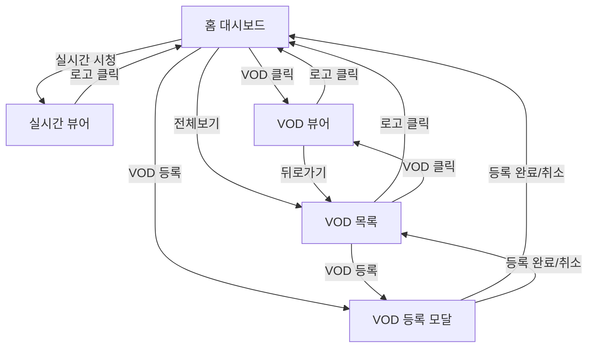

# 화면 명세 (06-screens.md)

> 경기도의회 실시간 자막 서비스

---

## 개요

| 항목 | 내용 |
|------|------|
| **서비스명** | 경기도의회 실시간 자막 서비스 |
| **핵심 기능** | FEAT-1: 실시간 자막, FEAT-2: 키워드 검색, FEAT-3: VOD 자막 |
| **총 화면 수** | 4개 |
| **인증 필요 화면** | 0개 (MVP: 인증 없음) |

---

## 화면 목록

### 1. 홈 대시보드 (/)

| 항목 | 내용 |
|------|------|
| **화면 ID** | S-01 |
| **연결 기능** | 진입점, FEAT-1, FEAT-3 |
| **인증 필요** | No |
| **진입점** | URL 직접 접속 |

**주요 요소:**
- **헤더**: 로고, 서비스명
- **실시간 회의 카드**: 현재 실시간 회의 상태 표시
  - 방송중: 🔴 Live 배지 + "실시간 시청하기" 버튼
  - 방송전: 다음 회의 일정 표시
  - 방송 없음: "예정된 회의가 없습니다"
- **최근 VOD 목록**: 최근 5개 VOD
  - 날짜, 제목, 재생시간, 자막 상태 (✅완료 / ⏳생성중)
- **VOD 전체보기 버튼**: VOD 목록 페이지로 이동
- **VOD 등록 버튼**: VOD 등록 모달 열기

**사용자 액션:**
- "실시간 시청하기" 클릭 → 실시간 뷰어 (S-02)
- VOD 항목 클릭 → VOD 뷰어 (S-04)
- "전체보기" 클릭 → VOD 목록 (S-03)
- "등록" 클릭 → VOD 등록 모달

**이동 가능 화면:**
- → 실시간 뷰어 (방송중일 때)
- → VOD 목록 (전체보기)
- → VOD 뷰어 (VOD 클릭)

---

### 2. 실시간 뷰어 (/live)

| 항목 | 내용 |
|------|------|
| **화면 ID** | S-02 |
| **연결 기능** | FEAT-1: 실시간 자막, FEAT-2: 키워드 검색 |
| **인증 필요** | No |
| **진입점** | 홈 "실시간 시청하기" 버튼 |

**주요 요소:**
- **헤더**: 로고 (← 홈으로), 회의 제목, 🔴 Live 배지, 검색창
- **영상 플레이어 (70%)**: HLS 스트리밍 영상
  - HLS.js로 재생
  - 볼륨 컨트롤
- **자막 히스토리 패널 (30%)**:
  - 시간 + 자막 텍스트 (화자는 색상으로 구분)
  - 실시간 업데이트 (WebSocket)
  - 새 자막 도착 시 자동 스크롤
  - 자막 클릭 → 해당 시점 이동
- **검색 기능**:
  - 검색어 입력 시 키워드 하이라이트 (노란색)
  - 검색 결과(하이라이트된 자막) 클릭 → 시점 이동

**사용자 액션:**
- 로고 클릭 → 홈 (S-01)
- 검색어 입력 → 자막 하이라이트
- 자막 항목 클릭 → 영상 해당 시점 이동
- 하이라이트된 자막 클릭 → 영상 해당 시점 이동

**이동 가능 화면:**
- → 홈 (로고 클릭)

**빈 상태:**
- 자막 없음: "자막을 불러오는 중..." 스피너

**에러 상태:**
- WebSocket 연결 끊김: "연결이 끊어졌습니다. 재연결 중..." 토스트
- 스트림 로드 실패: "영상을 불러올 수 없습니다. 새로고침해주세요."

---

### 3. VOD 목록 (/vod)

| 항목 | 내용 |
|------|------|
| **화면 ID** | S-03 |
| **연결 기능** | FEAT-3: VOD 자막 |
| **인증 필요** | No |
| **진입점** | 홈 "전체보기" 버튼 |

**주요 요소:**
- **헤더**: 로고 (← 홈으로), "VOD 목록" 제목, VOD 등록 버튼
- **VOD 목록 테이블/카드**:
  - 날짜: 회의 날짜
  - 제목: 회의 제목
  - 재생시간: 총 시간 (HH:MM:SS)
  - 자막 상태: ✅ 자막완료 / ⏳ 자막생성중 (진행률%) / ❌ 자막없음
  - 클릭 시 VOD 뷰어로 이동
- **페이지네이션**: 페이지당 10개

**사용자 액션:**
- 로고 클릭 → 홈 (S-01)
- VOD 항목 클릭 → VOD 뷰어 (S-04)
- "VOD 등록" 클릭 → VOD 등록 모달

**이동 가능 화면:**
- → 홈 (로고 클릭)
- → VOD 뷰어 (VOD 클릭)

**빈 상태:**
- VOD 없음: "등록된 VOD가 없습니다. 첫 번째 VOD를 등록해보세요!" + [등록하기] 버튼

---

### 4. VOD 뷰어 (/vod/:id)

| 항목 | 내용 |
|------|------|
| **화면 ID** | S-04 |
| **연결 기능** | FEAT-3: VOD 자막, FEAT-2: 키워드 검색 |
| **인증 필요** | No |
| **진입점** | 홈 VOD 클릭, VOD 목록 VOD 클릭 |

**주요 요소:**
- **헤더**: 로고 (← 홈으로), 회의 제목, 📁 VOD 배지, 검색창
- **영상 플레이어 (70%)**: MP4 재생
  - 재생/일시정지
  - 타임라인 시크
  - 배속 조절 (1x, 1.5x, 2x)
  - 볼륨 컨트롤
  - 현재 시간 / 전체 시간
- **자막 히스토리 패널 (30%)**:
  - 시간 + 자막 텍스트
  - 전체 자막 로드됨
  - 현재 재생 위치 자막 하이라이트 (파란 테두리)
  - 재생 위치에 따라 자동 스크롤
  - 자막 클릭 → 해당 시점 이동
- **검색 기능**: 실시간 뷰어와 동일

**사용자 액션:**
- 로고 클릭 → 홈 (S-01)
- 뒤로가기 → VOD 목록 (S-03) 또는 이전 페이지
- 재생/일시정지 → 영상 제어
- 타임라인 드래그 → 시점 이동
- 배속 버튼 → 재생 속도 변경
- 자막 항목 클릭 → 영상 해당 시점 이동
- 검색어 입력 → 자막 하이라이트

**이동 가능 화면:**
- → 홈 (로고 클릭)
- → VOD 목록 (뒤로가기)

**빈 상태:**
- 자막 생성 중: "자막을 생성하고 있습니다... (60%)" 프로그레스바
- 자막 없음: "자막이 아직 생성되지 않았습니다." + [자막 생성하기] 버튼

**에러 상태:**
- 영상 로드 실패: "영상을 불러올 수 없습니다."
- VOD 없음: "존재하지 않는 VOD입니다." → 홈으로 버튼

---

## 모달

### M-01. VOD 등록 모달

| 항목 | 내용 |
|------|------|
| **모달 ID** | M-01 |
| **트리거** | 홈/VOD목록 "VOD 등록" 버튼 |

**주요 요소:**
- **제목 입력**: "회의 제목" (필수)
- **날짜 선택**: "회의 날짜" (필수)
- **URL 입력**: "VOD URL" (필수)
  - 예시: https://kms.ggc.go.kr/mp4/...
- **취소 버튼**: 모달 닫기
- **등록 버튼**: VOD 등록 → 자막 생성 시작

**유효성 검사:**
- 제목: 필수, 2자 이상
- 날짜: 필수
- URL: 필수, URL 형식

**액션:**
- 등록 성공 → 토스트 "VOD가 등록되었습니다. 자막 생성을 시작합니다." → 모달 닫기
- 등록 실패 → 에러 메시지 표시

---

## 화면 흐름도



---

## 화면 연결 매트릭스

| From \ To | 홈 | 실시간 | VOD목록 | VOD뷰어 | 등록모달 |
|-----------|-----|--------|---------|---------|---------|
| **홈**        | -   | ✓      | ✓       | ✓       | ✓       |
| **실시간**    | ✓   | -      |         |         |         |
| **VOD목록**   | ✓   |        | -       | ✓       | ✓       |
| **VOD뷰어**   | ✓   |        | ✓       | -       |         |
| **등록모달**  | ✓   |        | ✓       |         | -       |

---

## 공통 요소

### 헤더 (Header)

```
┌─────────────────────────────────────────────────────────────────┐
│  [로고] 경기도의회 자막                  [검색창]               │
└─────────────────────────────────────────────────────────────────┘
```

- 로고: 클릭 시 홈으로
- 검색창: 뷰어 화면에서만 표시

### 토스트 (Toast)

- 위치: 우하단
- 자동 사라짐: 3초
- 종류: 성공 (초록), 에러 (빨강), 정보 (파랑)

---

## 반응형 브레이크포인트

| 디바이스 | 너비 | 주요 변화 |
|----------|------|----------|
| 모바일 | < 768px | 영상 100%, 자막 아래 배치, 검색 아이콘화 |
| 태블릿 | 768px ~ 1024px | 60%/40% 분할 |
| 데스크톱 | > 1024px | 70%/30% 분할 |

---

## 다음 단계

이 문서를 기반으로:

1. **`/screen-spec`** 실행 → 각 화면별 상세 YAML 명세 생성
2. **`/tasks-generator`** 실행 → 화면 단위 태스크 생성

```
06-screens.md (이 문서)
    ↓
/screen-spec (선택)
    ↓
specs/screens/*.yaml
    ↓
/tasks-generator
    ↓
TASKS.md
```
