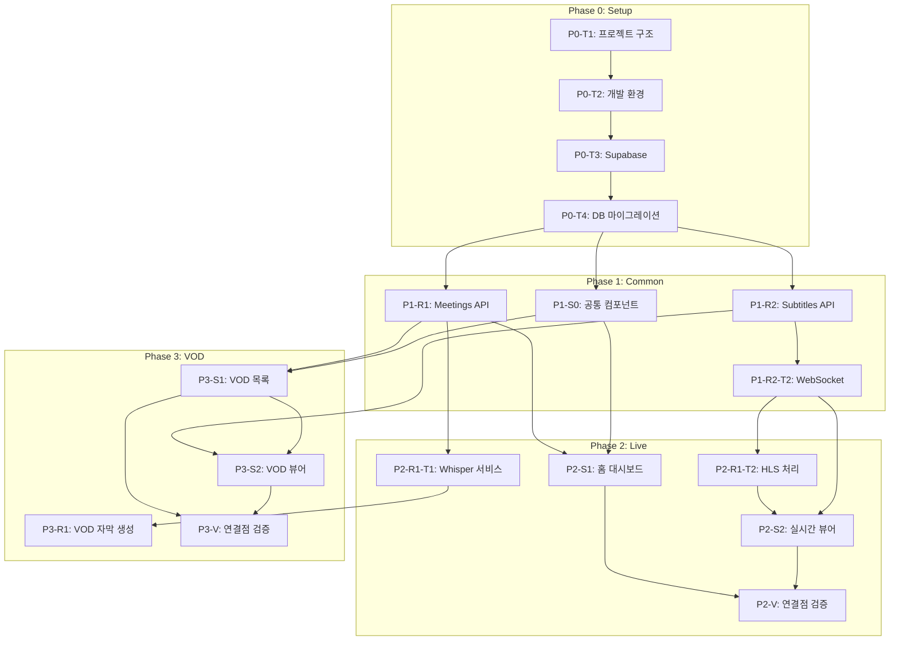

# TASKS.md - 경기도의회 실시간 자막 서비스

> Domain-Guarded 화면 단위 태스크 구조
> 생성일: 2026-02-05

---

## 개요

| 항목 | 내용 |
|------|------|
| 총 Phase | 4개 (P0 ~ P3) |
| 총 태스크 | 약 25개 |
| Backend Resources | 2개 (meetings, subtitles) |
| Frontend Screens | 4개 + 1 모달 |
| TDD 적용 | Phase 1+ 전체 |

---

## Phase 0: 프로젝트 초기화

> **Git Worktree**: 불필요 (main 브랜치에서 직접 작업)

### [x] P0-T1: 프로젝트 구조 생성
- **담당**: setup
- **작업**:
  - Next.js 14 프로젝트 생성 (frontend/)
  - FastAPI 프로젝트 생성 (backend/)
  - 모노레포 구조 설정
- **파일**:
  ```
  /
  ├── frontend/          # Next.js 14
  │   ├── src/
  │   │   ├── app/       # App Router
  │   │   ├── components/
  │   │   ├── hooks/
  │   │   ├── lib/
  │   │   └── types/
  │   ├── package.json
  │   └── tsconfig.json
  ├── backend/           # FastAPI
  │   ├── app/
  │   │   ├── api/
  │   │   ├── core/
  │   │   ├── models/
  │   │   └── services/
  │   ├── tests/
  │   ├── requirements.txt
  │   └── pyproject.toml
  └── docker-compose.yml
  ```
- **완료 조건**: `npm run dev` (frontend), `uvicorn app.main:app` (backend) 실행 가능

### [x] P0-T2: 개발 환경 설정
- **담당**: setup
- **작업**:
  - ESLint, Prettier 설정 (frontend)
  - Ruff, Black 설정 (backend)
  - TypeScript strict 모드
  - Python type hints
- **파일**: `.eslintrc.js`, `.prettierrc`, `pyproject.toml`
- **완료 조건**: `npm run lint`, `ruff check` 통과

### [x] P0-T3: Supabase 연동
- **담당**: setup
- **작업**:
  - Supabase 프로젝트 생성
  - 환경변수 설정 (.env.local, .env)
  - Supabase 클라이언트 설정
- **파일**: `backend/app/core/database.py`, `frontend/src/lib/supabase.ts`
- **완료 조건**: DB 연결 테스트 통과

### [x] P0-T4: 데이터베이스 마이그레이션
- **담당**: setup
- **작업**:
  - meetings 테이블 생성
  - subtitles 테이블 생성
  - councilors 테이블 생성
  - dictionary 테이블 생성
  - 인덱스 생성
  - Realtime 활성화 (subtitles)
- **파일**: `backend/migrations/001_initial.sql`
- **SQL 참조**: `docs/planning/04-database-design.md`
- **완료 조건**: 모든 테이블 생성, `supabase db push` 성공

---

## Phase 1: 공통 인프라

> **Git Worktree**: `worktree/phase-1-common`
> **TDD**: RED → GREEN → REFACTOR

### P1-R1: Meetings Resource (Backend)

#### [ ] P1-R1-T1: Meetings API 구현
- **담당**: backend-specialist
- **리소스**: meetings
- **엔드포인트**:
  | Method | Path | 설명 |
  |--------|------|------|
  | GET | /api/meetings | 회의 목록 조회 |
  | GET | /api/meetings/live | 실시간 회의 조회 |
  | GET | /api/meetings/{id} | 회의 상세 조회 |
  | POST | /api/meetings | VOD 회의 등록 |
- **필드**: id, title, meeting_date, stream_url, vod_url, status, duration_seconds, created_at, updated_at
- **파일**:
  - `backend/tests/api/test_meetings.py` (먼저)
  - `backend/app/api/meetings.py`
  - `backend/app/models/meeting.py`
  - `backend/app/schemas/meeting.py`
- **TDD**:
  1. RED: 테스트 작성 → 실패 확인
  2. GREEN: API 구현 → 테스트 통과
  3. REFACTOR: 코드 정리
- **완료 조건**: `pytest tests/api/test_meetings.py` 통과

### P1-R2: Subtitles Resource (Backend)

#### [ ] P1-R2-T1: Subtitles API 구현
- **담당**: backend-specialist
- **리소스**: subtitles
- **엔드포인트**:
  | Method | Path | 설명 |
  |--------|------|------|
  | GET | /api/meetings/{meeting_id}/subtitles | 자막 목록 |
  | GET | /api/meetings/{meeting_id}/subtitles/search | 자막 검색 |
- **필드**: id, meeting_id, start_time, end_time, text, speaker, confidence, created_at
- **파일**:
  - `backend/tests/api/test_subtitles.py`
  - `backend/app/api/subtitles.py`
  - `backend/app/models/subtitle.py`
  - `backend/app/schemas/subtitle.py`
- **TDD**: RED → GREEN → REFACTOR
- **완료 조건**: `pytest tests/api/test_subtitles.py` 통과

#### [ ] P1-R2-T2: WebSocket 실시간 자막
- **담당**: backend-specialist
- **리소스**: subtitles (realtime)
- **엔드포인트**: WS /ws/meetings/{meeting_id}/subtitles
- **이벤트**:
  - `subtitle_created`: 새 자막 브로드캐스트
- **파일**:
  - `backend/tests/websocket/test_subtitle_ws.py`
  - `backend/app/api/websocket.py`
- **완료 조건**: WebSocket 연결 및 메시지 수신 테스트 통과

### P1-S0: 공통 레이아웃 (Frontend)

#### [ ] P1-S0-T1: 공통 컴포넌트 구현
- **담당**: frontend-specialist
- **컴포넌트**:
  | 컴포넌트 | 파일 | 기능 |
  |---------|------|------|
  | Header | `components/Header.tsx` | 로고, 제목, 검색창, 배지 |
  | Toast | `components/Toast.tsx` | 알림 토스트 |
  | Badge | `components/Badge.tsx` | Live/VOD/상태 배지 |
  | SubtitleItem | `components/SubtitleItem.tsx` | 자막 아이템 |
- **스타일 참조**: `docs/planning/05-design-system.md`
- **파일**:
  - `frontend/src/components/__tests__/Header.test.tsx`
  - `frontend/src/components/Header.tsx`
  - (각 컴포넌트 동일 패턴)
- **TDD**: 컴포넌트 테스트 먼저 작성
- **완료 조건**: `npm test -- --coverage` 80%+ 커버리지

#### [ ] P1-S0-T2: 레이아웃 설정
- **담당**: frontend-specialist
- **작업**:
  - RootLayout 설정
  - Pretendard 폰트 적용
  - TailwindCSS 테마 설정
  - 반응형 브레이크포인트 적용
- **파일**:
  - `frontend/src/app/layout.tsx`
  - `frontend/tailwind.config.js`
  - `frontend/src/app/globals.css`
- **완료 조건**: 폰트 로드, 테마 색상 적용 확인

---

## Phase 2: 핵심 기능 - 실시간 자막

> **Git Worktree**: `worktree/phase-2-live`
> **TDD**: RED → GREEN → REFACTOR

### P2-R1: Whisper 통합 (Backend)

#### [ ] P2-R1-T1: Whisper 서비스 구현
- **담당**: backend-specialist
- **작업**:
  - OpenAI Whisper API 클라이언트
  - 오디오 청크 → 텍스트 변환
  - 의원 명단 프롬프트 적용
  - 용어 사전 후처리
- **파일**:
  - `backend/tests/services/test_whisper.py`
  - `backend/app/services/whisper.py`
  - `backend/app/services/dictionary.py`
- **환경변수**: `OPENAI_API_KEY`
- **완료 조건**: Whisper API 호출 및 후처리 테스트 통과

#### [ ] P2-R1-T2: HLS 스트림 처리
- **담당**: backend-specialist
- **작업**:
  - HLS 세그먼트 다운로드
  - 오디오 추출 (ffmpeg)
  - 청크 단위 Whisper 호출
  - 실시간 자막 생성 파이프라인
- **파일**:
  - `backend/tests/services/test_stream_processor.py`
  - `backend/app/services/stream_processor.py`
- **완료 조건**: HLS → 자막 변환 E2E 테스트 통과

### P2-S1: 홈 대시보드 화면

#### [ ] P2-S1-T1: 홈 UI 구현
- **담당**: frontend-specialist
- **화면**: S-01 (/)
- **컴포넌트**:
  | 컴포넌트 | 기능 |
  |---------|------|
  | LiveMeetingCard | 실시간 회의 상태 카드 |
  | RecentVodList | 최근 VOD 목록 |
  | VodActions | 전체보기/등록 버튼 |
- **데이터 요구**: meetings (live, vods)
- **파일**:
  - `frontend/src/app/page.test.tsx`
  - `frontend/src/app/page.tsx`
  - `frontend/src/components/LiveMeetingCard.tsx`
  - `frontend/src/components/RecentVodList.tsx`
- **TDD**: RED → GREEN → REFACTOR
- **데모**: http://localhost:3000/
- **완료 조건**: 컴포넌트 렌더링 + API 연동 테스트 통과

#### [ ] P2-S1-T2: 홈 API 연동
- **담당**: frontend-specialist
- **작업**:
  - `/api/meetings/live` 호출
  - `/api/meetings?status=processing,ended&limit=5` 호출
  - SWR/React Query 캐싱
- **파일**:
  - `frontend/src/hooks/useLiveMeeting.ts`
  - `frontend/src/hooks/useRecentVods.ts`
- **완료 조건**: API 연동 테스트 통과

### P2-S2: 실시간 뷰어 화면

#### [ ] P2-S2-T1: 실시간 뷰어 UI 구현
- **담당**: frontend-specialist
- **화면**: S-02 (/live)
- **컴포넌트**:
  | 컴포넌트 | 기능 |
  |---------|------|
  | HlsPlayer | HLS 스트리밍 재생 (HLS.js) |
  | SubtitlePanel | 자막 히스토리 패널 |
  | SearchInput | 키워드 검색 |
- **레이아웃**: 70% 영상 / 30% 자막
- **파일**:
  - `frontend/src/app/live/page.test.tsx`
  - `frontend/src/app/live/page.tsx`
  - `frontend/src/components/HlsPlayer.tsx`
  - `frontend/src/components/SubtitlePanel.tsx`
- **완료 조건**: 레이아웃 렌더링 + HLS 재생 테스트 통과

#### [ ] P2-S2-T2: WebSocket 실시간 자막 연동
- **담당**: frontend-specialist
- **작업**:
  - WebSocket 연결 (`/ws/meetings/{id}/subtitles`)
  - `subtitle_created` 이벤트 처리
  - 자동 스크롤
  - 재연결 로직
- **파일**:
  - `frontend/src/hooks/useSubtitleWebSocket.ts`
- **완료 조건**: 실시간 자막 수신 + 표시 테스트 통과

#### [ ] P2-S2-T3: 키워드 검색 기능
- **담당**: frontend-specialist
- **작업**:
  - 검색어 입력 → 자막 하이라이트 (노란색)
  - 하이라이트된 자막 클릭 → 시점 이동
- **파일**:
  - `frontend/src/hooks/useSubtitleSearch.ts`
  - `frontend/src/utils/highlight.ts`
- **완료 조건**: 검색 + 하이라이트 + 시점 이동 테스트 통과

### [ ] P2-V: Phase 2 연결점 검증
- **담당**: test-specialist
- **검증 항목**:
  - [ ] `/` → `/live` 네비게이션 (방송중일 때만)
  - [ ] meetings 리소스 필드 커버리지
  - [ ] subtitles 리소스 필드 커버리지
  - [ ] WebSocket 연결/재연결
  - [ ] HLS 스트림 재생
- **파일**: `frontend/e2e/phase2-live.spec.ts`
- **완료 조건**: E2E 테스트 통과

---

## Phase 3: 핵심 기능 - VOD 자막

> **Git Worktree**: `worktree/phase-3-vod`
> **TDD**: RED → GREEN → REFACTOR

### P3-R1: VOD 자막 생성 (Backend)

#### [ ] P3-R1-T1: VOD 자막 생성 서비스
- **담당**: backend-specialist
- **작업**:
  - MP4 → 오디오 추출 (ffmpeg)
  - Whisper API 배치 처리
  - 자막 DB 저장
  - 백그라운드 태스크 (Celery or asyncio)
- **파일**:
  - `backend/tests/services/test_vod_processor.py`
  - `backend/app/services/vod_processor.py`
  - `backend/app/tasks/subtitle_generation.py`
- **완료 조건**: VOD → 자막 생성 E2E 테스트 통과

### P3-S1: VOD 목록 화면

#### [ ] P3-S1-T1: VOD 목록 UI 구현
- **담당**: frontend-specialist
- **화면**: S-03 (/vod)
- **컴포넌트**:
  | 컴포넌트 | 기능 |
  |---------|------|
  | VodTable | VOD 목록 테이블 |
  | SubtitleStatusBadge | 자막 상태 배지 |
  | Pagination | 페이지네이션 |
- **파일**:
  - `frontend/src/app/vod/page.test.tsx`
  - `frontend/src/app/vod/page.tsx`
  - `frontend/src/components/VodTable.tsx`
- **완료 조건**: 테이블 렌더링 + 페이지네이션 테스트 통과

#### [ ] P3-S1-T2: VOD 등록 모달
- **담당**: frontend-specialist
- **화면**: M-01
- **컴포넌트**: VodRegisterModal
- **폼 필드**: title, meeting_date, vod_url
- **유효성 검사**:
  - 제목: 필수, 2자 이상
  - 날짜: 필수
  - URL: 필수, URL 형식
- **파일**:
  - `frontend/src/components/__tests__/VodRegisterModal.test.tsx`
  - `frontend/src/components/VodRegisterModal.tsx`
- **완료 조건**: 폼 유효성 검사 + API 연동 테스트 통과

### P3-S2: VOD 뷰어 화면

#### [ ] P3-S2-T1: VOD 뷰어 UI 구현
- **담당**: frontend-specialist
- **화면**: S-04 (/vod/:id)
- **컴포넌트**:
  | 컴포넌트 | 기능 |
  |---------|------|
  | Mp4Player | MP4 재생 (배속 지원) |
  | SubtitlePanel | 전체 자막 표시 |
  | VideoControls | 재생/일시정지, 타임라인, 배속 |
- **파일**:
  - `frontend/src/app/vod/[id]/page.test.tsx`
  - `frontend/src/app/vod/[id]/page.tsx`
  - `frontend/src/components/Mp4Player.tsx`
- **완료 조건**: 영상 재생 + 자막 표시 테스트 통과

#### [ ] P3-S2-T2: 자막 동기화 기능
- **담당**: frontend-specialist
- **작업**:
  - 영상 시간 → 현재 자막 하이라이트
  - 자막 패널 자동 스크롤
  - 자막 클릭 → 영상 시점 이동
- **파일**:
  - `frontend/src/hooks/useSubtitleSync.ts`
- **완료 조건**: 자막 동기화 + 시점 이동 테스트 통과

### [ ] P3-V: Phase 3 연결점 검증
- **담당**: test-specialist
- **검증 항목**:
  - [ ] `/` → `/vod` 네비게이션
  - [ ] `/vod` → `/vod/:id` 네비게이션
  - [ ] VOD 등록 모달 동작
  - [ ] 자막 상태 배지 표시
  - [ ] 자막 동기화
- **파일**: `frontend/e2e/phase3-vod.spec.ts`
- **완료 조건**: E2E 테스트 통과

---

## 의존성 그래프



---

## 병렬 실행 가능 태스크

| Phase | 병렬 가능 태스크 |
|-------|----------------|
| P0 | P0-T1 ~ P0-T4 (순차) |
| P1 | P1-R1 ∥ P1-R2 ∥ P1-S0 |
| P2 | P2-R1 (순차) → P2-S1 ∥ P2-S2 |
| P3 | P3-R1 → P3-S1 ∥ P3-S2 |

---

## 성공 기준

| 메트릭 | 목표 |
|--------|------|
| 자막 지연 | < 5초 |
| 의회 용어/의원 이름 정확도 | > 90% |
| 테스트 커버리지 (Backend) | > 80% |
| 테스트 커버리지 (Frontend) | > 80% |
| E2E 테스트 통과율 | 100% |

---

## 다음 단계

1. `git checkout -b feature/phase-0-setup`
2. P0-T1부터 순차 진행
3. Phase 완료 시 PR → main 머지
4. 다음 Phase worktree 생성 후 진행
