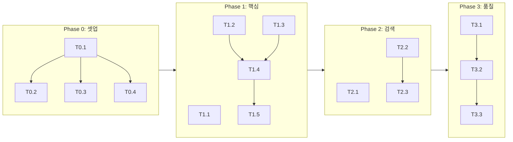

# TASKS: 경기도의회 실시간 자막 시스템 (ggc-subtitle)

## 메타
- **스택**: Next.js 16 + React 19 + Drizzle ORM + PostgreSQL (Supabase) + RTZR STT API
- **태스크**: 15개 (P0: 4, P1: 5, P2: 3, P3: 3)
- **생성일**: 2026-02-01

---

## P0: 프로젝트 셋업 (완료)

### [x] P0-T0.1: 프로젝트 초기화
- **담당**: frontend-specialist
- **작업**: Next.js 16 + TypeScript + Tailwind CSS 설정
- **산출물**: `package.json`, `tsconfig.json`, `tailwind.config.ts`
- **Worktree**: ❌ (main 직접)

### [x] P0-T0.2: 데이터베이스 스키마 설계
- **담당**: database-specialist
- **작업**: Drizzle ORM 스키마, Supabase 연결
- **산출물**: `src/db/schema.ts`, `src/db/client.ts`
- **Worktree**: ❌ (main 직접)

### [x] P0-T0.3: RTZR API 연동
- **담당**: backend-specialist
- **작업**: RTZR 인증, 파일 전사 API 구현
- **산출물**: `src/app/api/auth/rtzr/route.ts`, `src/app/api/rtzr/transcribe/route.ts`
- **Worktree**: ❌ (main 직접)

### [x] P0-T0.4: KMS 비디오 프록시
- **담당**: backend-specialist
- **작업**: KMS URL에서 비디오 추출, CORS 프록시
- **산출물**: `src/app/api/kms/video-url/route.ts`, `src/app/api/kms/proxy/route.ts`
- **Worktree**: ❌ (main 직접)

---

## P1: 핵심 기능 (완료)

### [x] P1-T1.1: 비디오 플레이어 컴포넌트
- **담당**: frontend-specialist
- **작업**: HLS/MP4 재생, 재생 속도 조절
- **산출물**: `src/components/video/VideoPlayer.tsx`
- **Worktree**: `worktree/phase-1-core`

### [x] P1-T1.2: 오디오 캡처 및 STT 스트리밍
- **담당**: frontend-specialist
- **작업**: Web Audio API로 PCM 캡처, HTTP 배치 전송
- **산출물**: `src/lib/audio/capture.ts`, `src/hooks/useRtzrStream.ts`, `src/hooks/useSubtitleSession.ts`
- **Worktree**: `worktree/phase-1-core`

### [x] P1-T1.3: 자막 표시 컴포넌트
- **담당**: frontend-specialist
- **작업**: 자막 오버레이, 타임라인 UI
- **산출물**: `src/components/subtitle/SubtitleOverlay.tsx`, `src/components/subtitle/SubtitleTimeline.tsx`
- **Worktree**: `worktree/phase-1-core`

### [x] P1-T1.4: 자막 DB 저장 연동
- **담당**: backend-specialist
- **의존**: T1.2, T1.3
- **작업**: 생성된 자막을 실시간으로 DB에 저장, 세션별 관리
- **스펙**:
  - 자막 생성 시 자동 DB 저장
  - 세션 시작/종료 시 상태 업데이트
  - 기존 세션 자막 불러오기
- **AC**: 자막 저장 지연 < 1초, 세션 상태 정확
- **산출물**: `src/hooks/useSubtitleSession.ts` 수정, API 연동
- **Worktree**: `worktree/phase-1-core`
- **TDD**: RED → GREEN → REFACTOR
- **완료일**: 2026-02-01

### [x] P1-T1.5: 자막 편집 기능
- **담당**: frontend-specialist
- **의존**: T1.4
- **작업**: 자막 텍스트 인라인 편집, 수정 내역 저장
- **스펙**:
  - 타임라인에서 자막 클릭 시 편집 모드
  - 수정 시 원본 텍스트 보존
  - 수정 내역 subtitle_edits 테이블에 저장
- **AC**: 편집 후 즉시 반영, 원본 복원 가능
- **산출물**: `src/components/subtitle/SubtitleEditor.tsx`, `src/app/api/subtitles/[id]/route.ts`
- **Worktree**: `worktree/phase-1-core`
- **TDD**: RED → GREEN → REFACTOR
- **완료일**: 2026-02-01

---

## P2: 검색 및 히스토리 (완료)

### [x] P2-T2.1: 자막 검색 UI
- **담당**: frontend-specialist
- **의존**: P1 완료
- **작업**: 전체 자막 검색 페이지, 하이라이팅
- **스펙**:
  - 키워드 검색 입력
  - 검색 결과 목록 (세션 정보 포함)
  - 클릭 시 해당 시간으로 이동
- **AC**: 검색 결과 < 500ms, 하이라이팅 정확
- **산출물**: `src/app/search/page.tsx`
- **Worktree**: `worktree/phase-2-search`
- **TDD**: RED → GREEN → REFACTOR
- **완료일**: 2026-02-01

### [x] P2-T2.2: 세션 히스토리 페이지
- **담당**: frontend-specialist
- **의존**: P1 완료
- **작업**: 과거 세션 목록, 자막 다시보기
- **스펙**:
  - 세션 목록 (날짜, 제목, 자막 개수)
  - 세션 클릭 시 비디오 + 저장된 자막 표시
  - 페이지네이션
- **AC**: 세션 목록 로드 < 1초
- **산출물**: `src/app/history/page.tsx`, `src/app/history/[id]/page.tsx`
- **Worktree**: `worktree/phase-2-search`
- **TDD**: RED → GREEN → REFACTOR
- **완료일**: 2026-02-01

### [x] P2-T2.3: 자막 내보내기
- **담당**: backend-specialist
- **의존**: T2.2
- **작업**: SRT/VTT 형식 자막 다운로드
- **스펙**:
  - SRT 형식 지원
  - VTT 형식 지원
  - 파일명에 세션 정보 포함
- **AC**: 10000개 자막 변환 < 2초
- **산출물**: `src/app/api/subtitles/export/route.ts`
- **Worktree**: `worktree/phase-2-search`
- **TDD**: RED → GREEN → REFACTOR
- **완료일**: 2026-02-01

---

## P3: 품질 및 배포 (완료)

### [x] P3-T3.1: 테스트 작성
- **담당**: test-specialist
- **의존**: P1, P2 완료
- **작업**: 핵심 기능 테스트 작성
- **스펙**:
  - API 라우트 테스트 (vitest)
  - 컴포넌트 테스트 (testing-library)
  - E2E 테스트 (Playwright) 선택
- **AC**: 핵심 기능 커버리지 > 70%
- **산출물**: `tests/` 디렉토리 (45개 테스트)
- **Worktree**: `worktree/phase-3-quality`
- **TDD**: 테스트 먼저 검토 후 보완
- **완료일**: 2026-02-01

### [x] P3-T3.2: 보안 검사
- **담당**: security-specialist
- **의존**: T3.1
- **작업**: OWASP 검사, 환경변수 검증
- **스펙**:
  - API 키 노출 검사
  - SQL 인젝션 방지 확인
  - CORS 설정 검토
- **AC**: CRITICAL 취약점 0개
- **산출물**: `docs/planning/security-report.md`
- **Worktree**: `worktree/phase-3-quality`
- **완료일**: 2026-02-01

### [x] P3-T3.3: Vercel 배포
- **담당**: backend-specialist
- **의존**: T3.1, T3.2
- **작업**: Vercel 프로젝트 설정, 환경변수, 배포
- **스펙**:
  - 환경변수 설정 (RTZR, Supabase)
  - 빌드 확인
  - 프로덕션 배포
- **AC**: 빌드 성공, 주요 기능 동작
- **산출물**: `vercel.json`, `docs/planning/deploy-guide.md`
- **Worktree**: `worktree/phase-3-quality`
- **완료일**: 2026-02-01

---

## 의존성

```mermaid
flowchart LR
  subgraph P0[Phase 0: 셋업]
    T0.1 --> T0.2
    T0.1 --> T0.3
    T0.1 --> T0.4
  end

  subgraph P1[Phase 1: 핵심]
    T1.1
    T1.2
    T1.3
    T1.4
    T1.5
    T1.2 --> T1.4
    T1.3 --> T1.4
    T1.4 --> T1.5
  end

  subgraph P2[Phase 2: 검색]
    T2.1
    T2.2
    T2.3
    T2.2 --> T2.3
  end

  subgraph P3[Phase 3: 품질]
    T3.1
    T3.2
    T3.3
    T3.1 --> T3.2
    T3.2 --> T3.3
  end

  P0 --> P1
  P1 --> P2
  P2 --> P3
```

## 병렬 실행 가능 그룹

| Phase | 병렬 그룹 | 태스크 |
|-------|----------|--------|
| P1 | Group 1 | T1.1, T1.2, T1.3 (독립) |
| P1 | Group 2 | T1.4, T1.5 (순차) |
| P2 | Group 1 | T2.1, T2.2 (독립) |
| P2 | Group 2 | T2.3 (T2.2 의존) |
| P3 | - | T3.1 → T3.2 → T3.3 (순차) |

---

## 진행 상황 요약

| Phase | 완료 | 미완료 | 진행률 |
|-------|------|--------|--------|
| P0 | 4 | 0 | 100% |
| P1 | 5 | 0 | 100% |
| P2 | 3 | 0 | 100% |
| P3 | 3 | 0 | 100% |
| **총계** | **15** | **0** | **100%** |
